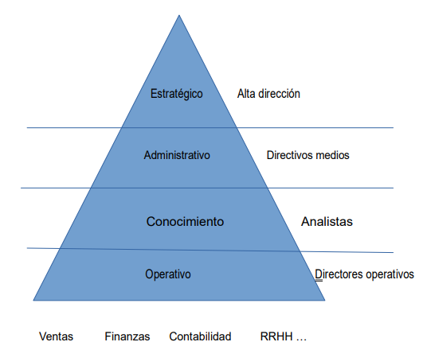

# UNIDAD 1 BASES DE DATOS

## Sistemas de información 

**Un sistema de información es el conjunto de elementos para la recopilación de datos y transformación en información relevantes**

Un sistema de información es especialmente adecuado en entornos complejos,
competitivos o muy cambiantes. En estos entornos los cambios son continuos, y la
rapidez en la toma de decisiones y la implementación de los cambios es crítica, por lo que
los gestores necesitan acceder de forma rápida y eficaz a las fuentes de información que
les permitan tomar las decisiones estratégicas más adecuadas.

 ### OBJETIVOS: el objetivo de un sistema de información será proveer a la organización de herramientas que le permitan:
- Automatizar los procesos operativos

- Propocionar información oportuna y exacta que sirva de apoyo para la toma de decisiones.

- obtener ventajas competitivas derivadas de su implatación y uso.

**FUNCIONES**
- Recolección de información 

- Tratamiento de la información (integración, realización de cálculos y transferencia de datos)

- difusión de la información (necesario identificar a quién,el que y el como se distribuye la información)

### Organización 

Los sistemas de información se organizan en varios niveles, cada uno de los cuales
se encarga de una función determinada:

- **Nivel operativo:** sistemas operacionales para la organización de la inforamción relevante para la organización de la propia BD. Cada departamento puede tener su propio sistema operacional y los usuarios suelen ser sus propios trabajadores.

- **Nivel de conocimento:** A este nivel corresponden los sistemas orientados al apoyo de las operaciones generadas por los sistemas del nivel operativo. Los usuarios de estos sistemas suelen ser analistas de alguna área específica de lamorganización.

- **Nivel administrativo:** 

